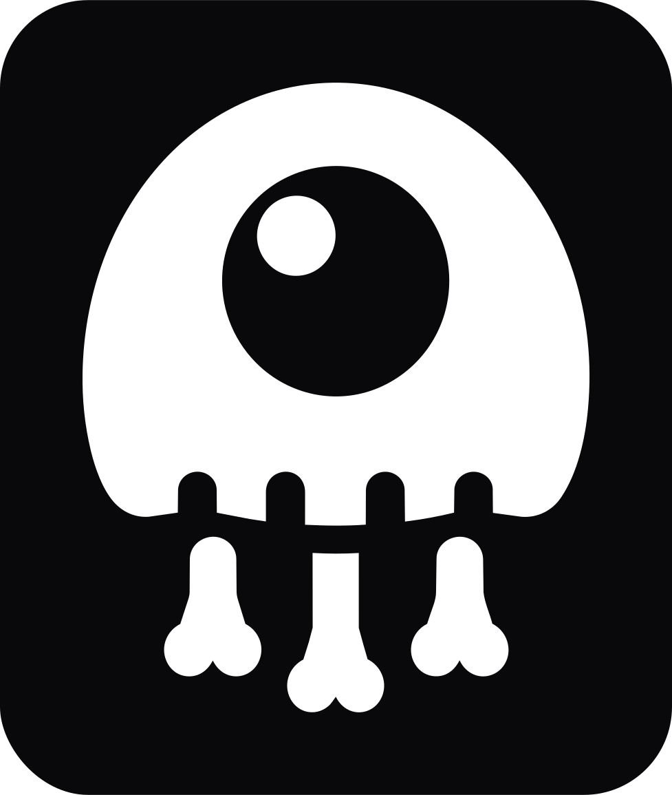

<p align="center">
    
</p>
<h1 align="center">Wirebones</h1>

Automatic skeleton placeholders for lazy Livewire components.

Wirebones captures the real rendered layout of your Livewire components in Chromium, converts it into compact skeleton markup, and serves that markup through Livewire's lazy placeholder flow.

Instead of hand-maintaining loading states that drift from the final UI, mark a component with `#[Wirebone]`, run a build, and let Wirebones generate production-ready placeholder Blade files.

## Requirements

- PHP 8.2+ with Laravel 12, or PHP 8.3+ with Laravel 13
- Laravel 12 or 13
- Livewire 4
- Node.js with Playwright Chromium installed

## Installation

Install the package with Composer:

```bash
composer require mrfelipemartins/wirebones
```

Install Playwright in your application:

```bash
npm install --save-dev playwright
npx playwright install chromium
```

Publish the configuration file when you need to customize capture or rendering behavior:

```bash
php artisan vendor:publish --tag=wirebones-config
```

## Getting Started

Add the `#[Wirebone]` attribute to a Livewire component and point `route` to a page where that component is rendered:

```php
use Livewire\Component;
use MrFelipeMartins\Wirebones\Attributes\Wirebone;

#[Wirebone(route: '/dashboard')]
class Revenue extends Component
{
    public function render()
    {
        return view('livewire.revenue');
    }
}
```

Render the component using Livewire delayed loading:

```blade
<livewire:revenue lazy />
```

Livewire 4 also supports deferred loading and bundled lazy requests:

```blade
<livewire:revenue defer />
<livewire:revenue lazy.bundle />
```

Run your Laravel app, then build the skeletons:

```bash
php artisan wirebones:build
```

By default, Wirebones uses `config('app.url')` as the base URL. You may also pass a URL explicitly:

```bash
php artisan wirebones:build http://localhost:8000
```

## Attribute Options

```php
use MrFelipeMartins\Wirebones\Attributes\Wirebone;

#[Wirebone(
    name: 'revenue-card',
    route: '/dashboard',
    breakpoints: [375, 768, 1280],
    wait: 800,
    leafTags: ['p', 'h1', 'h2'],
    excludeTags: ['svg'],
    excludeSelectors: ['[data-no-wirebone]'],
    captureRoundedBorders: true,
)]
```

- `name`: generated placeholder lookup name. Defaults to the Livewire-style component name.
- `route`: page Wirebones visits to capture the component.
- `breakpoints`: viewport widths to capture.
- `wait`: milliseconds to wait after page load before capturing.
- `leafTags`: tags captured as content bones.
- `excludeTags`: tags ignored during capture.
- `excludeSelectors`: CSS selectors ignored during capture.
- `captureRoundedBorders`: whether rendered border radius should be captured.

## Commands

List discovered Wirebone components:

```bash
php artisan wirebones:list
```

Build all generated placeholders:

```bash
php artisan wirebones:build
```

Build one or more components by Wirebone name:

```bash
php artisan wirebones:build --component=revenue-card
php artisan wirebones:build --component=revenue-card --component=user-table
```

Clear generated placeholder files:

```bash
php artisan wirebones:clear
```

Show the browser or print capture diagnostics while building:

```bash
php artisan wirebones:build --headed --debug
```

## Configuration

The published `config/wirebones.php` file controls capture, auth, generated output, and skeleton rendering.

Common options:

```php
'breakpoints' => [375, 768, 1280],

'wait' => 800,

'viewport_height' => 900,

'compiled_path' => storage_path('framework/wirebones/views'),

'animation' => 'pulse', // pulse, shimmer, solid

'render_containers' => true,

'responsive_strategy' => 'viewport', // viewport, container
```

Rendering values such as colors, animation, shimmer angle, and container rendering are baked into generated Blade files. Re-run `wirebones:build` after changing them.

## Authenticated Routes

If a captured route requires authentication, configure a build user and protect build mode with a token:

```dotenv
WIREBONES_BUILD_TOKEN=secret-build-token
WIREBONES_AUTH_USER_ID=1
WIREBONES_AUTH_GUARD=web
```

Wirebones will authenticate the Laravel request while build mode is active.

For applications that need browser-level auth, configure cookies, headers, or a Playwright storage state file:

```php
'auth' => [
    'guard' => env('WIREBONES_AUTH_GUARD', 'web'),
    'user_id' => env('WIREBONES_AUTH_USER_ID'),
    'cookies' => [
        ['name' => 'session', 'value' => env('WIREBONES_SESSION'), 'domain' => 'localhost', 'path' => '/'],
    ],
    'headers' => [
        'Authorization' => 'Bearer '.env('WIREBONES_API_TOKEN'),
    ],
    'storage_state' => storage_path('app/wirebones-storage-state.json'),
],
```

You may also pass cookies and headers directly to the build command:

```bash
php artisan wirebones:build \
    --cookie="session=abc123" \
    --header="Authorization: Bearer token"
```

## Local Development

Wirebones includes a Vite plugin that watches changed Livewire component PHP files and Blade views, then rebuilds only affected skeletons.

Import the plugin from the Composer package:

```js
import { defineConfig } from 'vite'
import laravel from 'laravel-vite-plugin'
import wirebones from './vendor/mrfelipemartins/wirebones/vite/index.js'

export default defineConfig({
    plugins: [
        laravel({ input: ['resources/css/app.css', 'resources/js/app.js'], refresh: true }),
        wirebones(),
    ],
})
```

The Laravel app server must already be running. The plugin runs only during `vite serve`, debounces changes, and executes targeted builds like:

```bash
php artisan wirebones:build --component=revenue-card
```

## Production

Generated placeholders are build artifacts. A typical deployment should:

1. Install Composer and Node dependencies.
2. Ensure Playwright Chromium is available in the build environment.
3. Run the Laravel application so configured capture routes are reachable.
4. Run `php artisan wirebones:build`.
5. Run `php artisan view:cache` if your deployment caches views.

## Laravel Boost

Wirebones ships a Laravel Boost skill at:

```text
resources/boost/skills/wirebones-development/SKILL.md
```

When users run Laravel Boost with package skill discovery, Boost can install this skill so AI agents understand Wirebones conventions, commands, generated Blade artifacts, authenticated captures, and the Vite auto-rebuild workflow.

## License

[MIT](LICENSE.md)
